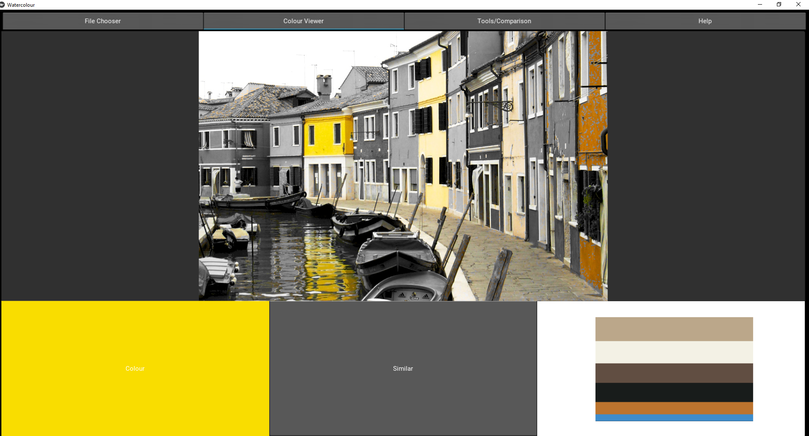

# Photo Feature Analysis for Watercolour Painting

This system provides various tools for analysing reference photos.
Interpret the visualised features for use in your watercolour painting.

# Table of Contents
- [Features](#features)
    - [File Chooser](#file-chooser)
    - [Colour Viewer](#colour-viewer)
        - [View exact colour](#view-exact-colour)
        - [View areas of similar colour](#view-areas-of-similar-colour)
        - [Colour palette chart](#colour-palette-chart)
    - [Tool Dashboard](#tool-dashboard)
        - [View colour values](#view-colour-values)
        - [Adjust colour temperature](#adjust-colour-temperature)
        - [Adjust colour saturation](#adjust-colour-saturation)
- [Installation](#installation)
- [Repository Structure](#structure)
- [Links](#links)

# Features

## File Chooser
Load and view images. Save and load sessions.

## Colour Viewer

### View exact colour
Click anywhere on the image to view the exact colour in the bottom-left colour box.

### View areas of similar colour
After selecting a colour, clicking the "similar" button will highlight all the areas of similar colour over 
a greyscale image.

Original           |    
:-------------------------:|:-------------------------:
Yellow   | 
 Blue  |     

### Colour palette chart
A chart showing the average colours to form a colour palette is generated upon loading an image.

## Tool Dashboard

Multiple tools can be added to the dashboard for comparison. Use the zoom in/out buttons.

### View colour values
Splits the image into shadows, mid-tones, and highlights. Adjust the minimum and maximum thresholds to suit the image. 
Increase the blur value to smooth the shapes and outlines.

Original apple image          |  Apple split into three values
:-------------------------:|:-------------------------:
   |  

### Adjust colour temperature
Move the slider to make the image warmer or cooler. The center is neutral.

Cool         |  Original | Warm
:-------------------------:|:-------------------------:|:-------------------------:
  |     |   

### Adjust colour saturation
Move the slider to increase or decrease the level of saturation.

### View average colour areas
Adjust the slide to view the image split into X averaged colours. This can be slow.

Original           |  2 colours  
:-------------------------:|:-------------------------:
 | 
 3 colours  |   6 colours 
  | 

# Installation

## Install Anaconda:
 - Download from https://www.anaconda.com/products/individual
 - Install
 - When installing, make sure you tick "Add Anaconda3 to my PATH environment variable"
   See screenshot

## Install python requirements
 - Open up the program folder in command line and run:
   `pip install -r requirements.txt`

## Install kivy extensions:
 - `garden install graph`
 - `garden install matplotlib`

### Run the application
 - `python ./main.py`

# Troubleshooting installation
## Install SciPi from whl:
 When installing requirements, should SciPy fail to install, you may need to install SciPy from a whl file, using the folowing instructions:
 - Go to https://www.lfd.uci.edu/~gohlke/pythonlibs/
 - Find Scipi
 - Find scipy‑1.5.4‑cp39‑cp39‑win_amd64.whl and download
 - Install using:
   `pip install scipy‑1.5.4‑cp39‑cp39‑win_amd64.whl`

# Structure

./Documentation
	
	This was where the html files generated by pdoc would have been output.

./images

	The test data is stored here.

./sessions
	
	A directory to store session files for testing.

./watercolour

	Contains Python files and .kv file.

./watercolour/tools
	
	Location of the tools inherited from Tool.

./
	The main program is accessed and ran from here.

# Links

Images used for testing:

https://ceklog.kindel.com/2013/02/19/why-nobody-can-copy-apple/
Apple image

https://www.flickr.com/photos/jocelyn777/46424164764/
Buildings 1

<https://www.flickr.com/photos/130426118@N08/44162429861/>
Cricket

https://www.flickr.com/photos/keepitsurreal/4002796077/
Trees 1

https://www.flickr.com/photos/jocelyn777/44358964814/
Buildings 2

https://www.flickr.com/photos/legin/9123210511/
Buildings 3

https://www.flickr.com/photos/adstream/2437427238/
Flowers1

https://www.flickr.com/photos/swan_corner/4844718484/
Flowers2

https://www.flickr.com/photos/caitlinhouse/6053531417/
Long

https://www.flickr.com/photos/homeofbastian/26923843458/
Buildsingsinside1

https://www.flickr.com/photos/kirksiang/3137859971/
Lantern1

https://www.flickr.com/photos/slapers/32771054968/
Lantern2

https://www.flickr.com/photos/fs999/49380655347/
Buildings4

https://www.flickr.com/photos/alaneng/3027870637/
Nutsseds

https://www.flickr.com/photos/andrew_kearns_photography/48715281066/
Arch

<https://www.flickr.com/photos/158652122@N02/27172745038/>
Stairs

https://www.flickr.com/photos/gaelvaroquaux/26309500128/
Portrait

https://www.flickr.com/photos/cttc/18657784296/
Flowers3

https://www.flickr.com/photos/duncanh1/51076393906/
Flowers4

<https://www.flickr.com/photos/8602028@N04/522512821/>
Fruit

<https://www.flickr.com/photos/155376904@N07/30108395527/>
Leafmacro1

https://www.flickr.com/photos/archeon/3045918295/
Macaw

https://www.flickr.com/photos/pimthida/14407749155/
Macaw_multiple_subjects